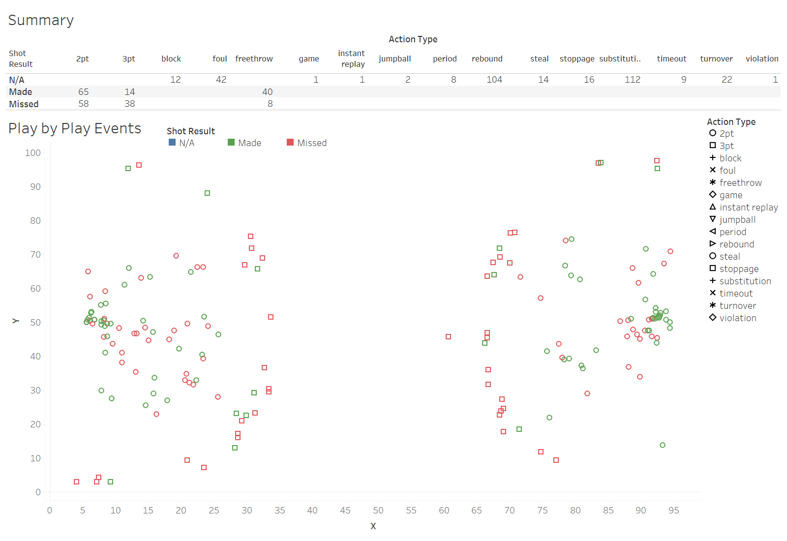
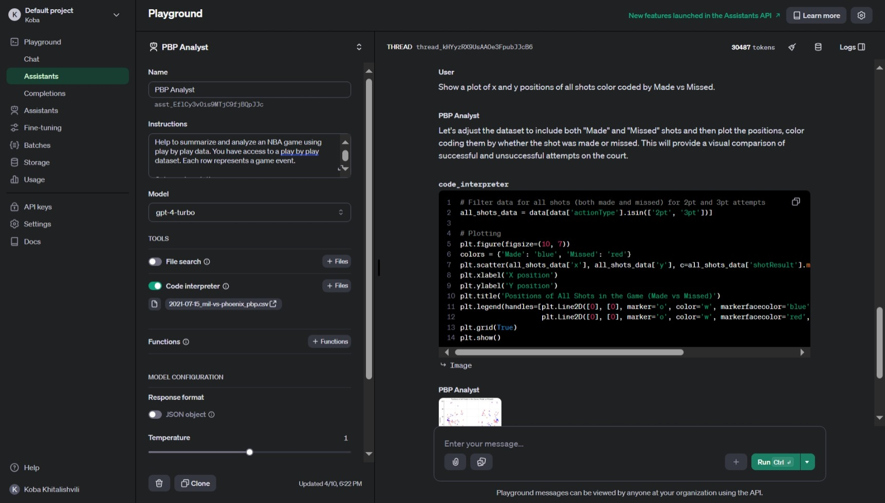
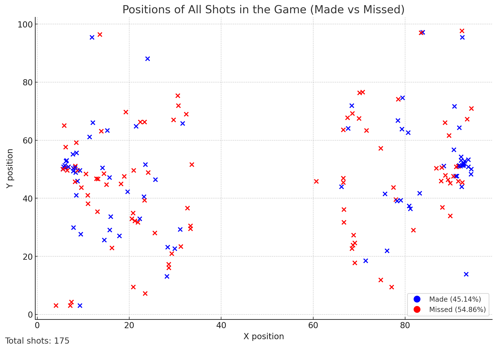

# Custom GPT to Analyize PBP Data

Building custom GPT to analyzie NBA PBP data.

Check out `eda.ipynb` to see how to obtain PBP from NBA.com api.

## Data Overview


## GPT Assisstant Demo

  > Show a plot of x and y positions of all shots color coded by Made vs Missed.



**Output**



## System Promt (WIP)

```
Help to summarize and analyze an NBA game using play by play data. You have access to a play by play dataset. Each row represents a game event. 

Column descriptions:
- pointsTotal is the cumulative number of points by player.
- actionType is the general description of a game event, ex.g. 2pt, 3pt, foul, violation, substitution, etc. 
- subType is a more detailed description of an event, ex. g. dunk, layup, jumpshot, etc.
- shotResult tells us whether a player made it or missed it.
- playerNameI is the players first name initial and last name.


```

